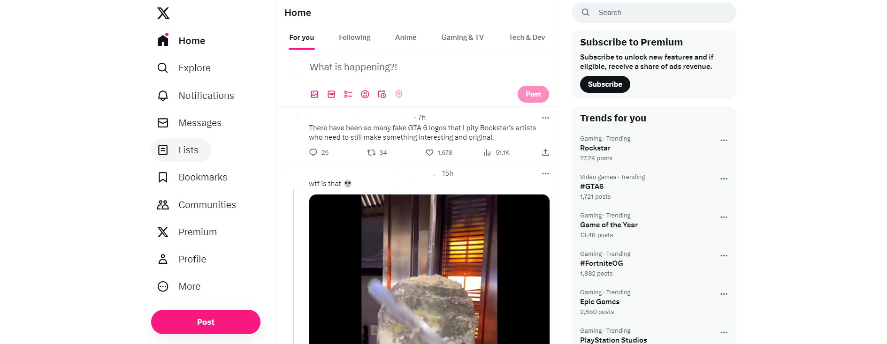
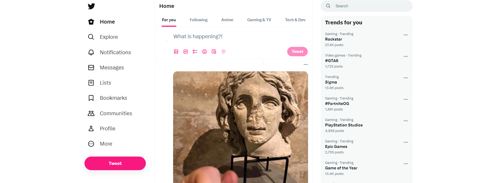

# Return Twitter
This Chrome extension brings back the old Twitter experience.

## Features
- Larry is back!
- Larry's house is back!
- There is no X, there is only Twitter
- Post or what? Anyway, did you see this Tweet?
- No premium ads!
- There is only a blue tick!  

## Installation
1. Clone this repository
2. Open `chrome://extensions/` in your browser
3. Enable Developer Mode
4. Click on "Load unpacked"
5. Select the cloned repository

## Screenshots
### Before

### After

